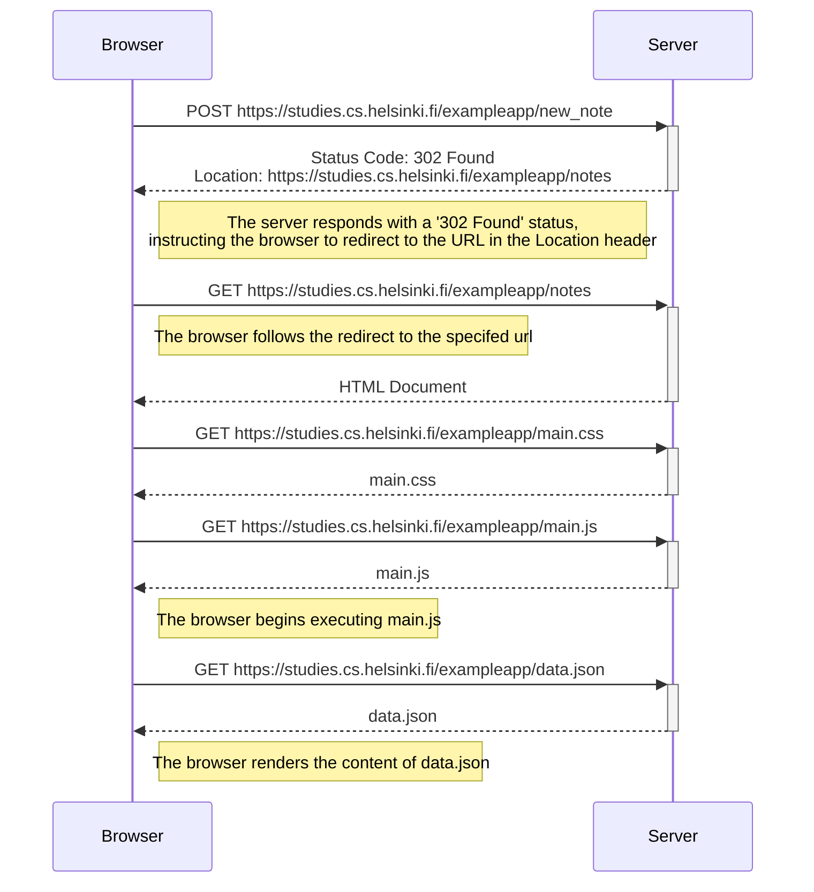

```mermaid
sequenceDiagram
    participant Browser
    participant Server

    Browser->>+Server: POST https://studies.cs.helsinki.fi/exampleapp/new_note
    Server-->>-Browser: Status Code: 302 Found <br/> Location: https://studies.cs.helsinki.fi/exampleapp/notes
    Note left of Server: The server responds with a '302 Found' status, <br/> instructing the browser to redirect to the URL in the Location header

    Browser->>+Server: GET https://studies.cs.helsinki.fi/exampleapp/notes
    Note right of Browser: The browser follows the redirect to the specifed url
    Server-->>-Browser: HTML Document

    Browser->>+Server: GET https://studies.cs.helsinki.fi/exampleapp/main.css
    Server-->>-Browser: main.css

    Browser->>+Server: GET https://studies.cs.helsinki.fi/exampleapp/main.js
    Server-->>-Browser: main.js
    Note right of Browser: The browser begins executing main.js

    Browser->>+Server: GET https://studies.cs.helsinki.fi/exampleapp/data.json
    Server-->>-Browser: data.json
    Note right of Browser: The browser renders the content of data.json
```
