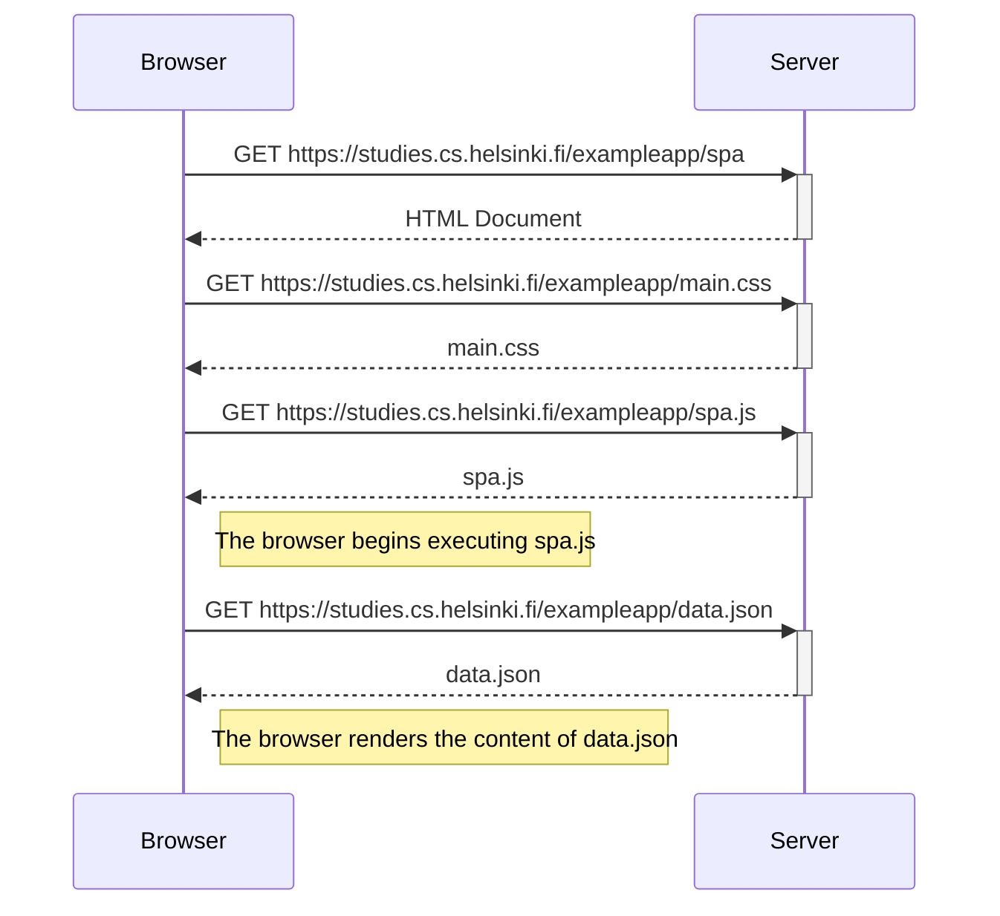

```mermaid
sequenceDiagram
    participant Browser
    participant Server

    Browser->>+Server: GET https://studies.cs.helsinki.fi/exampleapp/spa
    Server-->>-Browser: HTML Document

    Browser->>+Server: GET https://studies.cs.helsinki.fi/exampleapp/main.css
    Server-->>-Browser: main.css

    Browser->>+Server: GET https://studies.cs.helsinki.fi/exampleapp/spa.js
    Server-->>-Browser: spa.js
    Note right of Browser: The browser begins executing spa.js

    Browser->>+Server: GET https://studies.cs.helsinki.fi/exampleapp/data.json
    Server-->>-Browser: data.json
    Note right of Browser: The browser renders the content of data.json
```
